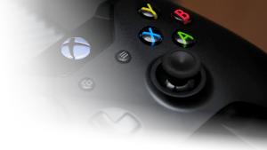

# steamboot

An [Arch Linux](https://archlinux.org/) Live USB derivate, booting directly into [Steam](https://store.steampowered.com/).

All you need is a PC with a local partition that can be used as home, in order to provide enough storage for Steam to download and launch games. There's no need to mess around with your bootloader to setup any dual- or triple-boot. Simply plug in the USB drive and turn any PC into an [Arch Linux](https://archlinux.org) driven HTPC gaming console.

## Features

* **Live USB** - No Installation required
* **Arch Linux** - Always using the latest Packages
* **Desktop Mode** - A Fully featured [GNOME Desktop](https://gnome.org)
* **GParted** - Resize Partitions directly from the Live ISO
* **Drivers** - NVIDIA, AMD and Intel Graphic Drivers Included